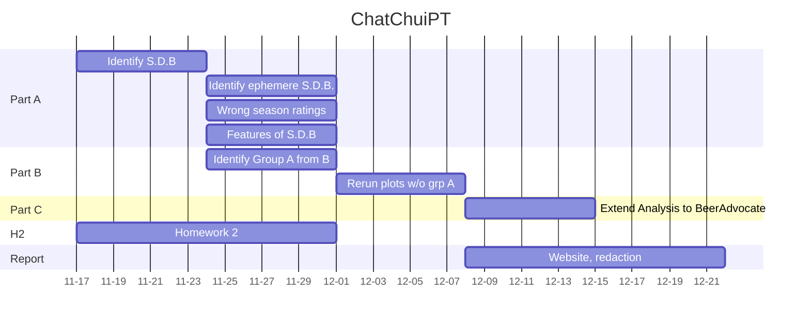

# Every Season is Beerable
# Abstract
- This project aims mainly at studying the beer trends based on seasons. In fact, each individual may tend to consume different
beers based on its mood or feeling influenced by the season. A study of a high variety of beers may help to see if some beers
have variable success rate accross the year or inversely have a constant consumption rate.
- After identifying how some specific types of beers are consumed at different times of the year, we could dig further those tendencies to see if they also varies accross the years. This would helps to identify if the beer success at some time was ephemere or inversely anchored in the consumption habits of beer drinkers.

to remove et ??? mettre dans notebook ???
- This quantitative analysis of the rate of consumption can be complemented with a sentimental analysis of the ratings and the comments. It is a good point to see that a beer is more consummed at one time in the year, but does the rating and the comments about this beer are also more positives ? This would indicate a change of the drinker's taste preference accross the seasons (in other words, would a user give a better or worse rating depending on wether he is consuming at the right time or not).

??? retaffer personnes a et b
- The dataset contains a high number of user of different profiles. We identified 2 main types of users:
    - A: The professional rater, he rates a high number of beers, accross a wide spectrum of beer style throughout the year, he might not taste beers accordingly to his preferences but rather for the sake of testing a high number of beers
    - B: The occasional rater, he rates a small number of beers, spontaneously testing beers he wants to
- Because of the non-seasonal behaviour nature of group A, we might have to first remove the group A to only perform the study on group B

# Research Questions
	Identify S.D.B
	Identify ephemere S.D.B.
	Wrong season ratings
	Features of S.D.B
    Identify Group A from B
	Rerun plots w/o grp A

## `Task 1:` World region
- Base the analysis for different region of the world. Make sure to take into account the hemisphere when evaluating for the season. ??? va pas le faire si ???

## `Task 2:` Season-dependent beer (e.g: beer almost exclusively drank during one season)
- Is a beer more incline to be consumed at one time of the year and if so, at which time of the year ?

## `Task 3:` Ephemere and long-lasting season dependent beers
- Do some beers are highly rated during only one season during one specific year and then are forgotten in the next years ?

## `Task 4:` Features of season-dependent beers
- Which characteristics such as the aroma, the taste, ... of a beer makes it to be more a spring-beer or a fall-beer ?

## `Task 5:` Drinking at the wrong season 
- Is there a shift of the season-dependent beer ratings if it is not tasted during the adequate period ?

## `Task 6:` Professional vs Occasional drinker
- Isolate group A from B and re-run all the analysis to see wether or not the seasonable beer pattern is accentuated without the group A.

## Commentary in adequation with the ratings ?
- Can we observe a correlation between the ratings values and the positivity degree of the commentaries using a sentimental analysis ?

# Proposed additional datasets (if any) 
- No additional dataset to provide, complete dataset !

# Methods
- Load the cached data, in order to minimize the loading time required to load the txt and csv files, the txt files were reshaped
and registered as csv files. The loading of the csv files was performed using a trick ??? kamil ??? allowing to load them locally
as DataFrames on the computer.

- After loading the data, we pre-processed the datasets for BeerAdvocate and RateBeer. This was done by merging the users'locations
with the ratings to obtain the location of each rating especially. The dates were also discretised in months and years
to perfom a monthly analysis of the ratings of different beer styles.

- The data was the cleaned. the unrelevant columns/duplicates were removed. Columns with missing values were identified and different
treatments were performed on them. For the alcohol degree (abv index), the missing values were remplaced by the average alcohol
degree of the corresponding beer style. As a rating without location is unuseful and this missing value cannot be estimated,
the NaNs of the location feature were removed.

- After cleaning the data, the two sites RateBeer and BeerAdvocate were compared. Firstly the distributions of the ratings were
compared. Are raters also writers? ???. After seeing that the USA users tended to consume a lower diversity of beers, we 
added the column country to the table in order to remove those consummers. To identify the most implicated countries, 
we plotted thecontribution of different countries in the % of ratings in Beer Advocate and RateBeer and mapped those percentages.
To study the rating fluctation of different styles of beers, we firstly identified the most rated style in the world. Then, we compared the weighting of the ratings for each sites to see how they could be comparable. This was done by performing a LinearRegression
on both sites' data and taking as features the appearance, aroma, palate, taste and overall and as output the rating.

- Now that the two sites have been compared and the dataset cleaned, the datasets were ready to be analysed more deeply. The monthly rating number was plotted to have an idea of the overall rating dynamic that could influence the micro analysis to be done afterwards. The monthly distribution of the IPA, Pilsner and Belgian Strong Ale reviews was studied to observe the first patters of season-dependency. 
We then analysed the distribution of alcohol degree among beers compared to ratings indicating a big shift of the degree depending on the
best seller season of the beer.

- Then with statisticals analysis such as t-test or ... we will analyse which criterias such as  alcool percentage, appearance, aroma, palate, taste, or even users' location have the highest impact on the seasonality of the beer. This will help us to identify which kind
of beers are prefered at which time of the year. Then, a splitting of the dataset into clients types A and B will be conducted and similar
analysis as before will be performed to see if we really have at lesast 2 discernable categories of consummers in the batch of the users.

- To complement the findings, a sentimental analysis on the comments will be performed to see if the ratings and the comments' postivity correlate strongly to each others and if they also vary with the seasons. This would indicate a clear change of mood from the users in addition to their rating frequency. The sentimental analysis of the comments will be performed using an already trained machine learning classifier that could be downloaded on the site : https://huggingface.co/tasks/text-classification. This classifier assigns a grade based on the degree of positivity of the comment.

- Finally for a global view, we will inspect how the breweries proposal vary and converge to specific beers. This could show whiches beweries will sell a lot of beers at different time of the year depending on the major style of beer that is sold in it.

## Proposed timeline
beers variety accross seasons --> id kind of beers --> compare characteristics --> see tendencies variation accross year 
--> ratings of beers variation accross season also follows trends --> correlation between ratings and sentimental analysis 
of the comments --> beer trends description

causalité des patterns saisonniers --> les identifier et les grouper par pattern--> basé sur les critères : % alcool, 
causes des residuals (personnes A et B)
sentimental analysis correlated ratings et overall --> see patters
une fois types de bieres saisonniers --> id si beweries target certains types ? brasseries spéciales ?

# Organization within the team

