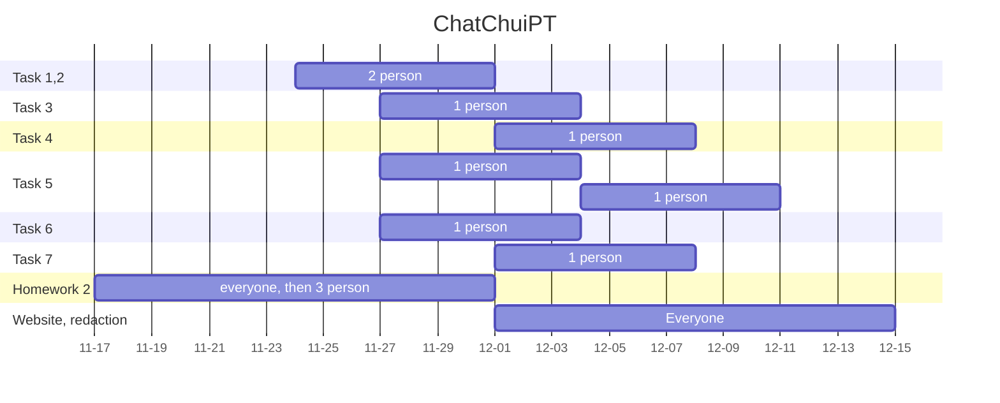

# Every Season is Beerable

Sip into the world of beer seasons with our DataStory – Grab your brew and dive in: [here](https://shobashu.github.io/ChatChuiPT.github.io/) !!!

## **Table of Contents** 

- [**0. Notebook Set-up**](#0-notebook-setup)
  - [0.1 Import libraries and some definitions](#0.1-import-libraries-and-some-definitions)
  - [0.2 Converting TXT to CSV and caching, pre-processing datasets for BeerAdvocate and RateBeer & Data Cleaning](#0.2-converting-txt-to-csv-and-caching-pre-processing-datasets-for-beeradvocate-and-ratebeer-and-data-cleaning) 

- [**1. Compare RateBeers and BeerAdvocate**](#1-compare-ratebeers-and-beeradvocate)
  - [1.1 Distribution of ratings and reviews per user between BeerAdvocate and RateBeer](#1.1-distribution-of-ratings-and-reviews-per-user-between-beeradvocate-and-ratebeer)
  - [1.2 Are raters also writers? Check the number of reviews compared to the number of ratings](#1.2-are-raters-also-writers-check-the-number-of-reviews-compared-to-the-number-of-ratings)
  - [1.3 Contribution of different countries in the number of ratings (World map visualization)](#1.3-contribution-of-different-countries-in-the-number-of-ratings-world-map-visualization)
  - [1.4 What is the most rated style in the whole world?](#1.4-what-is-the-most-rated-style-in-the-whole-world)
  - [1.5 Supervised Learning: the relation between the features (appearance, aroma, palate, taste, overall) and response (rating)](#1.5-supervised-learning-the-relation-between-the-features-appearance-aroma-palate-taste-overall-and-response-rating)
  - [1.6 Number of ratings per year](#1.6-number-of-ratings-per-year)
  - [1.7 Do we have users in common for both datasets? ](#1.7-do-we-have-users-in-common-for-both-datasets)
  - [1.8 Decision - Do we take BeerAdvocate or RateBeer or both datasets](#1.8-do-we-take-beeradvocate-or-ratebeer-or-both-datasets)

- [**2. Exploration of Characteristics Specific to Users**](#2-exploration-of-characteristics-specific-to-users)
  - [2.1 IPA](#2.1-ipa)
  - [2.2 Pilsener](#2.2-pilsener)
  - [2.3 Belg Strong Ale](#2.3-belg-strong-ale)
  - [2.4 Distribution of alcohol degree among two different beer styles](#2.4-distribution-of-alcohol-degree-among-two-different-beer-styles)

- [**3. Exploration of Beer Styles: Are There Seasonal Tendencies?**](#3-exploration-of-beer-styles-are-there-seasonal-tendencies)
  - [3.1 Distribution of ratings per month for all beers](#3.1-distribution-of-ratings-per-month-for-all-beers)
  - [3.2 Distribution of IPA, Pilsener, Belgian Strong Ale reviews normalized according to the total number of reviews](#3.2-distribution-of-ipa-pilsener-belgian-strong-ale-reviews-normalized-according-to-the-total-number-of-reviews)
    - [3.2.1 IPA](#3.2.1-ipa)
    - [3.2.2 Pilsener](#3.2.2-pilsener)
    - [3.2.3 Belg Strong Ale](#3.2.3-belg-strong-ale)

- [**4. Check Seasonality for Different Alcohol Degrees**](#4-check-seasonality-for-different-alcohol-degrees)
  - [4.1 Distribution of ABV among the dataframe](#4.1-distribution-of-abv-among-the-dataframe)
    - [4.1.1 Light beers - ABV < 5](#4.1.1-light-beers-abv-less-than-5)
    - [4.1.2 Strong beers - ABV between 8 & 20](#4.1.2-strong-beers-abv-between-8-and-20)
  - [4.2 T-test into ABV](#4.2-t-test-into-abv)
    - [4.2.1 T-test into Light beers](#4.2.1-t-test-into-light-beers)
    - [4.2.2 T-test into Strong beers](#4.2.2-t-test-into-strong-beers)

- [**5. Trends Depending on Color?**](#5-trends-depending-on-color)
  - [5.1 Distribution of estimated SRM values among the dataframe](#5.1-distribution-of-estimated-srm-values-among-the-dataframe)
    - [5.1.1 Pale beers](#5.1.1-pale-beers)
    - [5.1.2 Dark beers](#5.1.2-dark-beers)
    - [5.1.3 Medium color](#5.1.3-medium-color)
  - [5.2 T-test into SRM values](#5.2-t-test-into-srm-values)
    - [5.2.1 T-test into Pale beers](#5.2.1-t-test-into-pale-beers)
    - [5.2.2 T-test into Dark beers](#5.2.2-t-test-into-dark-beers)
    - [5.2.3 T-test into Medium beers](#5.2.3-t-test-into-medium-beers)

- [**6. Trends Depending on IBU (Bitterness)**](#6-trends-depending-on-ibu-bitterness)
  - [6.1 Distribution of estimated IBU values among the dataframe](#6.1-distribution-of-estimated-ibu-values-among-the-dataframe)
    - [6.1.1 Mild beers](#6.1.1-mild-beers)
    - [6.1.2 Bitter beers](#6.1.2-bitter-beers)
  - [6.2 T-test into IBU values](#6.2-t-test-into-ibu-values)
    - [6.2.1 T-test into Mild beers](#6.2.1-t-test-into-mild-beers)
    - [6.2.2 T-test into Bitter beers](#6.2.2-t-test-into-bitter-beers)

- [**7. Causality Check on ABV, SRM, IBU**](#7-causality-check-on-abv-srm-ibu)

- [**8. Best Beers**](#8-best-beers)
  - [8.1 Seasonality estimation of beers style](#8.1-seasonality-of-beers-style)
  - [8.2 Region specitiy of a high seasonality beer style](8.2-region-specificity-of-a-high-seasonality-beer-style)

- [**9.Conclusion**](#9-conclusion)

# Abstract
Winter is a season for brown beers, high on alcohol to warm us up, while summer makes us crave a lighter blond beer. But do we really observe trends based on seasons? In fact, each individual may tend to consume different beers based on its mood or feeling influenced by the season. A study of a high variety of beer styles may help to see if some beers have variable success rate accross the year or inversely have a constant consumption rate. After identifying the seasonal tendencies, we observed if those tendencies varied accross the year, i.e. is the beer success ephemere or anchored in the consumption habits of beer drinkers? Seeing this seasonal variability, we then tried to identify the best features in order to predict the seasonality of a beer. Once those features have been identified, the location was studied in order to evaluate the north america, europa and oceania beer consumption habits and their specificities. Once the seasonality was identified, the next step was to predict it by implementing a classifier model based the beer characteristics. Finally, to conclude the quest of seasonality, the most summer and winter trendy beers were identified.

# Research Questions
## `Task 1:` Season-dependent beer: normalized number of ratings (e.g: beer almost exclusively drank during one season)
- Is a beer getting more ratings at one time of the year and if so, at which time of the year ? 

## `Task 2:` Season-dependent beer: User specific characteristics
- Are the user specific characteristics (i.e. rating, overall, aroma, palate...) changing depending on the season?

## `Task 5:` Beer specific features of season-dependent beers
- Are the alcool degree (ABV), the bitterness (IBU) and the beer coloration (SRM) also important beer specific features for the seasonal dependency ?

## `Task 6:` Best seasonal beer award 
Beer styles regroup a big amount of beers and represent an average seasonality for a batch of beers. Thus, can we identify the most winter and summer beers, which are the most impacted by the year periods ?

## `Task 7:` Beer seasonality predictor model
-Is it possbile to predict the seasonality of a beer based only on its ABV, IBU and SRM using linear models ? 

## `Task 8:` Region specificity
Now that a worldwide pattern have been observed for the number of ratings for different styles of beers, do we find also this pattern at smaller scale ? Do we have different specific regionality patterns in North America, Europa or Oceania ?

# Proposed additional datasets (if any) 
- Two additionals datasets were provided to complete the data with the bitterness index and the color index of the beer. The Bitterness dataset (called IBU) and the colorness (called SRM) were found based on multiple site comparisons and ChatGPT to confirm the reliability of the results. Note that those values are only an approximation of the real indexes but due to the binary classification (and not continuous prediction), the error that could be added is reasonable as we exclude beers with intermediate bitterness and/or color and only focus on extreme values for the seasonality.

# Methods
- For each ratings, the location was added with a union operation between the ratings and the users dataset (based on user_id). The dates were also discretised in months and years in order to perfom a monthly analysis. Ratings with missing abv index were completed with the average abv of the corresponding beer style. Ratings with missing location, date or beer style were dropped from the dataset.

- The two sites RateBeer and BeerAdvocate were compared. To identify the most implicated countries, 
the contribution of different countries in the % of ratings was plotted in Beer Advocate and RateBeer and those percentages were mapped.
For the seasonal variability of ratings, we firstly identified the most rated style in the world. Then, we compared the weighting of the ratings for each sites. This was done by performing a LinearRegression for the two sites and taking as features the appearance, aroma, palate, taste and overall and as output the rating.

- The datasets were now ready to be analysed more in depth. The monthly rating number was plotted to have an idea of the overall rating dynamic that could influence the micro analysis to be done afterwards. The monthly distribution of the IPA, Pilsner and Belgian Strong Ale reviews was studied to observe the first patterns of season-dependency.

- With statistical analysis such as t-test and statistical model such as Seasonal-Trend decomposition using LOESS (STL) we analysed which feature such as alcool degree, appearance, aroma, palate, taste, abv (alcool degree), ibu (bitterness index) or srm (color of the beer) have the highest impact on the seasonality of the beer. This enables us to identify which kind of beers are prefered at which time of the year.

- Once the parameters such as ABV, IBU and SRM have been explored, a study of their interdependencies is necessary to evaluate their predictability power. This was performed by measuring the intercorrelations between those parameters using scatter plots and correlation coefficient. The information to extract from this will be very helpful to perform a seasonality prediction model. Finally, to implement this model, linear and polynomial regressions methods were performed. Those methods allowed to classify beers, based on its ABV, IBU and SRM values, as summer or winter beers.

# Timeline and organization within the team

# Install requirements

Now that you have a good overview of the project, here are the command lines to set
an adequate python environment to run this project :

*create the environment: python -m venv .venv

*activate the environment: source /.venv/bin/activate.sh

*install the packages: pip install -r requirements.txt

# Repository architecture
<pre>
├── Maps
│   └── Ratings repartitions for Beeradvocate and Ratebeer
├── Website
│   └── Plots and images added to the website
├── .gitignore
├── helper_functions.py
├── main.ipynb
├── main_html.ipynb
├── main_plotly.ipynb
├── output.html
├── readme.md
└── requirements.txt
</pre>
