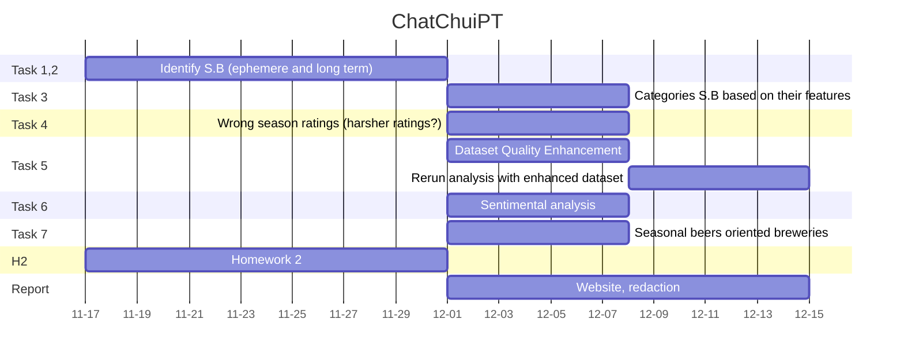

# Every Season is Beerable
# Abstract
- This project aims mainly at studying the beer trends based on seasons. In fact, each individual may tend to consume different beers based on its mood or feeling influenced by the season. A study of a high variety of beers may help to see if some beers have variable success rate accross the year or inversely have a constant consumption rate.
- After identifying how some specific types of beers are consumed at different times of the year, we could dig further those tendencies to see if they also varies accross the years. This would helps to identify if the beer success at some time was ephemere or inversely anchored in the consumption habits of beer drinkers.

to remove et ??? mettre dans notebook ???
- This quantitative analysis of the rate of consumption can be complemented with a sentimental analysis of the ratings and the comments. It is a good point to see that a beer is more consummed at one time in the year, but does the rating and the comments about this beer are also more positives ? This would indicate a change of the drinker's taste preference accross the seasons (in other words, would a user give a better or worse rating depending on wether he is consuming at the right time or not).

# Research Questions
## `Task 1:` Season-dependent beer (e.g: beer almost exclusively drank during one season)
- Is a beer more incline to be consumed at one time of the year and if so, at which time of the year ?

## `Task 2:` Ephemere and long-lasting season dependent beers
- Do some beers are highly rated during only one season during one specific year and then are forgotten in the next years ?

## `Task 3:` Features of season-dependent beers
- Which characteristics such as the aroma, the taste, ... of a beer makes it to be more a spring-beer or a fall-beer ?

## `Task 4:` Drinking at the wrong season 
- Is there a shift of the season-dependent beer ratings if it is not tasted during the adequate period ?

## `Task 5:` Dataset Quality Enhancement
### Professional vs Occasional drinker
- The dataset contains a high number of user of different profiles. We identified 2 main types of users:
    - `A:` The professional rater, he rates a high number of beers, accross a wide spectrum of beer style throughout the year, he might not taste beers accordingly to his preferences or what fits the current season
    - `B:` The occasional rater, he rates a small number of beers, spontaneously testing beers he wants to
- Isolate group `A` from `B` and re-run all the analysis to see wether or not the seasonable beer pattern is accentuated without the group `B`

### Elude ratings from south hemipshere
- Having in the same dataset ratings from south and north hemisphere might lead to self-canceling of the season cycles. One could either delete ratings from the S.H or offset by 6 months the time of S.H ratings

## `Task 6:` Sentimental analysis
- Compute the "distance" between the actual rating's grade and the inferred grade from the textual content (using natural language processing tools like [Hugging Face](https://huggingface.co/tasks/text-classification) or the proposed method from paper ...)
- Perform this test for group `A` and `B` on seasonal and non-seasonal beers
- Will users from group `B` be more precise in their ratings than group `A` for seasonal beers, is it also the case for non-seasonal beers ?

## `Task 7:` Seasonal beers oriented breweries
- Identify wether or not breweries focus more on seasonal beers than others
- If so, what are their characteristics

# Proposed additional datasets (if any) 
- No additional dataset to provide, complete dataset !

# Methods
- Load the cached data, in order to minimize the loading time required to load the txt and csv files, the txt files were reshaped
and registered as csv files. The loading of the csv files was performed using a trick ??? kamil ??? allowing to load them locally
as DataFrames on the computer.

- After loading the data, we pre-processed the datasets for BeerAdvocate and RateBeer. This was done by merging the users'locations
with the ratings to obtain the location of each rating especially. The dates were also discretised in months and years
to perfom a monthly analysis of the ratings of different beer styles.

- The data was the cleaned. the unrelevant columns/duplicates were removed. Columns with missing values were identified and different
treatments were performed on them. For the alcohol degree (abv index), the missing values were remplaced by the average alcohol
degree of the corresponding beer style. As a rating without location is unuseful and this missing value cannot be estimated,
the NaNs of the location feature were removed.

- After cleaning the data, the two sites RateBeer and BeerAdvocate were compared. Firstly the distributions of the ratings were
compared. Are raters also writers? ???. After seeing that the USA users tended to consume a lower diversity of beers, we 
added the column country to the table in order to remove those consummers. To identify the most implicated countries, 
we plotted thecontribution of different countries in the % of ratings in Beer Advocate and RateBeer and mapped those percentages.
To study the rating fluctation of different styles of beers, we firstly identified the most rated style the whole world. 

??? to end

   
Graphs plotting for different kind of beers, evolution accross time, evolution between years by superposition, ...
correlation between senitmental analysis of comments and ratings ?
sentimental analysis of comments in order to grade the comments with a high positivity etc for example with the site : 
https://huggingface.co/tasks/text-classification

## Summary (TODO REMOVE)
### 0. Load the cached data
### 1. Pre-processing datasets for BeerAdvocate and RateBeer
- 1.1 Merge users and ratings to obtain location of each rating especially
- 1.2 Change the date format and isolate month and year
### 2. Data Cleaning 
- 2.1 Remove unrelevant columns/duplicates
- 2.2 Identification of columns that have missing values
- 2.3 Replace abv (alcohol degree) missing values by the average abv of the corresponding beer style
- 2.4 Drop NaN for location -> remove ratings where location is not mentioned
### 3. Compare RateBeers and BeerAdvocate
- 3.1 Distribution of ratings and reviews between BeerAdvocate and RateBeer
- 3.2 Are raters also writers? Check nbr of reviews compared to nbr of ratings
- 3.3 New column: country, to remove states in USA
- 3.4 Plot contribution of different countries in the % of ratings in Beer Advocate and RateBeer
- 3.5 Mapping of ratings
- 3.6 What is the most rated style the whole world in RateBeer & Beer Advocate?
- 3.7 Supervised Learning : the relation between the features (*appearance, aroma, palate, taste, overall*) and response (*rating*)
- 3.8 Do we have users in common for both datasets?
### 4. Exploration of the dataset RateBeer: Seasonal tendancies?
- 4.1 Distribution of ratings per month for all beers
- 4.2 Distribution of IPA, Pilsner and Belgian Strong Ale reviews normalized according to total number of reviews
- 4.3 Distribution of alcohol degree among beers compared to ratings -> do people drink a lot of strong beers?

## Proposed timeline
causalité des patterns saisonniers --> les identifier et les grouper par pattern--> basé sur les critères : % alcool, critères de notation, location des users
causes des residuals (personnes A et B)
sentimental analysis correlated ratings et overall --> see patters
une fois types de bieres saisonniers --> id si beweries target certains types ? brasseries spéciales ?

# Organization within the team

S.B: Seasonal Beer