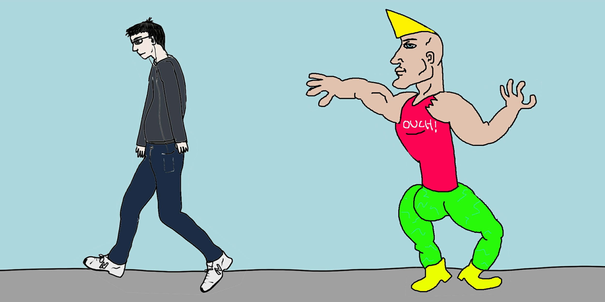

# Every Season is Beerable

# Abstract
- This project aims mainly at studying the beer trends based on seasons. In fact, each individual may tend to consume different
beers based on its mood or feeling influenced by the season. A study of a high variety of beers may helps to see if some beers
have variable success rate accross the year or inversely have a constant consumption rate.
- After identifying how some specific types of beers are consumed at different times of the year, we could dig further those tendencies to see if they also 
varies accross the years. This would let us know if the beer success at some time was ephemere or inversely anchored in the consumption habits of beer drinkers.
- This quantitative analysis of the rate of consumption can be complemented with a sentimental analysis of the ratings and the comments. It is a good point to see that a beer is more consummed at one time in the year, but does the rating and the comments about this beer are also more positives ? This would indicate a change of the drinker's taste preference accross the seasons (in other words, would a user give a better or worse rating depending on wether or not he is consuming at the right time).
- The dataset contains a high number of user of different profiles. We identified 2 main types of users:
    - A: The professional rater, he rates a high number of beers, accross a wide spectrum of beer style throughout the year, he might not taste beers accordingly to his preferences but rather for the sake of testing a high number of beers
    - B: The occasional rater, he rates a small number of beers, actually test beers he wanted to
- Because of the non-seasonal behaviour nature of group A, we might have to first remove the group A to only perform the study on group B

# Research Questions

add analysis for diff countries ? mouais --> better to specialize on one kind of countries !!

Is a beer more incline to be consumed at one time of the year ? 

Which characteristics of a beer makes it to be more a spring-beer or a fall-beer ?

Do people consume one type of beer more due to its better taste than usual ? 

Are the rating of the beer and the commentary given for it in adequation to each others ?

Do some beers only follow some one season trend and would then be forgotten in the next years ?

## Proposed additional datasets (if any) 

No additional dataset to provide, complete dataset !

## Methods

Graphs plotting for different kind of beers, evolution accross time, evolution between years by superposition, ...
correlation between senitmental analysis of comments and ratings ?
sentimental analysis of comments in order to grade the comments with a high positivity etc for example with the site : 
https://huggingface.co/tasks/text-classification

## Proposed timeline

beers variety accross seasons --> id kind of beers --> compare characteristics --> see tendencies variation accross year 
--> ratings of beers variation accross season also follows trends --> correlation between ratings and sentimental analysis 
of the comments --> beer trends description

## Organization within the team

