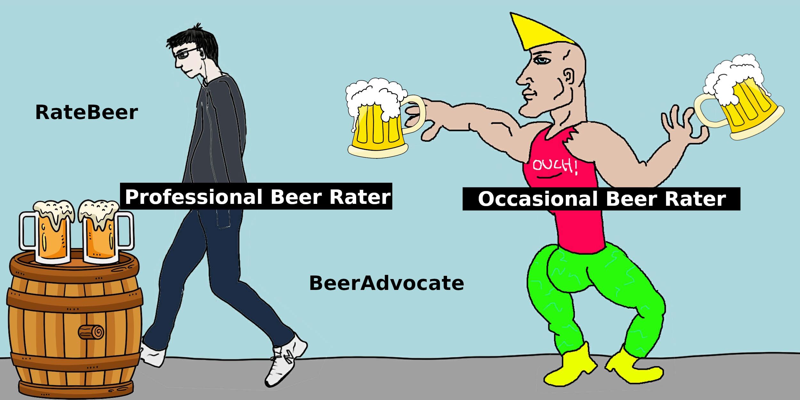
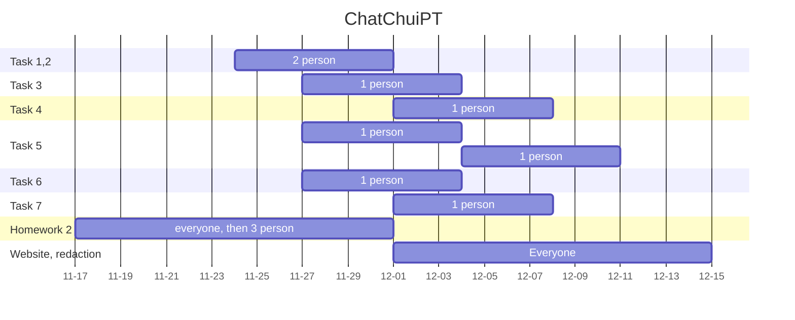

# Every Season is Beerable

## **Table of Contents** 

- [**0. Notebook Set-up**](#0-notebook-setup)
  - [0.1 Import libraries and some definitions](#0.1-import-libraries-and-some-definitions)
  - [0.2 Converting TXT to CSV and caching](#0.2-converting-txt-to-csv-and-caching)
  - [0.3 Pre-processing datasets for BeerAdvocate and RateBeer](#0.3-pre-processing-datasets-for-beeradvocate-and-ratebeer)
  - [0.4 Data cleaning](#0.4-data-cleaning)

- [**1. Compare RateBeers and BeerAdvocate**](#1-compare-ratebeers-and-beeradvocate)
  - [1.1 Distribution of ratings and reviews per user between BeerAdvocate and RateBeer](#1.1-distribution-of-ratings-and-reviews-per-user-between-beeradvocate-and-ratebeer)
  - [1.2 Are raters also writers? Check the number of reviews compared to the number of ratings](#1.2-are-raters-also-writers-check-the-number-of-reviews-compared-to-the-number-of-ratings)
  - [1.3 Contribution of different countries in the number of ratings (World map visualization)](#1.3-contribution-of-different-countries-in-the-number-of-ratings-world-map-visualization)
  - [1.4 What is the most rated style in the whole world?](#1.4-what-is-the-most-rated-style-in-the-whole-world)
  - [1.5 Supervised Learning: the relation between the features (appearance, aroma, palate, taste, overall) and response (rating)](#1.5-supervised-learning-the-relation-between-the-features-appearance-aroma-palate-taste-overall-and-response-rating)
  - [1.6 Number of ratings per year](#1.6-number-of-ratings-per-year)
  - [1.7 Do we have users in common for both datasets? Decision - Do we take BeerAdvocate or RateBeer or both datasets -](#1.7-do-we-have-users-in-common-for-both-datasets-decision-do-we-take-beeradvocate-or-ratebeer-or-both-datasets)

- [**2. Exploration of Characteristics Specific to Users**](#2-exploration-of-characteristics-specific-to-users)
  - [2.1 IPA](#2.1-ipa)
  - [2.2 Pilsener](#2.2-pilsener)
  - [2.3 Belg Strong Ale](#2.3-belg-strong-ale)
  - [2.4 Distribution of alcohol degree among two different beer styles](#2.4-distribution-of-alcohol-degree-among-two-different-beer-styles)

- [**3. Exploration of Beer Styles: Are There Seasonal Tendencies?**](#3-exploration-of-beer-styles-are-there-seasonal-tendencies)
  - [3.1 Distribution of ratings per month for all beers](#3.1-distribution-of-ratings-per-month-for-all-beers)
  - [3.2 Distribution of IPA, Pilsener, Belgian Strong Ale reviews normalized according to the total number of reviews](#3.2-distribution-of-ipa-pilsener-belgian-strong-ale-reviews-normalized-according-to-the-total-number-of-reviews)
    - [3.2.1 IPA](#3.2.1-ipa)
    - [3.2.2 Pilsener](#3.2.2-pilsener)
    - [3.2.3 Belg Strong Ale](#3.2.3-belg-strong-ale)

- [**4. Check Seasonality for Different Alcohol Degrees**](#4-check-seasonality-for-different-alcohol-degrees)
  - [4.1 Distribution of ABV among the dataframe](#4.1-distribution-of-abv-among-the-dataframe)
    - [4.1.1 Light beers - ABV < 5](#4.1.1-light-beers-abv-less-than-5)
    - [4.1.2 Strong beers - ABV between 8 & 20](#4.1.2-strong-beers-abv-between-8-and-20)
  - [4.2 T-test into ABV](#4.2-t-test-into-abv)
    - [4.2.1 T-test into Light beers](#4.2.1-t-test-into-light-beers)
    - [4.2.2 T-test into Strong beers](#4.2.2-t-test-into-strong-beers)

- [**5. Trends Depending on Color?**](#5-trends-depending-on-color)
  - [5.1 Distribution of estimated SRM values among the dataframe](#5.1-distribution-of-estimated-srm-values-among-the-dataframe)
    - [5.1.1 Pale beers](#5.1.1-pale-beers)
    - [5.1.2 Dark beers](#5.1.2-dark-beers)
    - [5.1.3 Medium color](#5.1.3-medium-color)
  - [5.2 T-test into SRM values](#5.2-t-test-into-srm-values)
    - [5.2.1 T-test into Pale beers](#5.2.1-t-test-into-pale-beers)
    - [5.2.2 T-test into Dark beers](#5.2.2-t-test-into-dark-beers)
    - [5.2.3 T-test into Medium beers](#5.2.3-t-test-into-medium-beers)

- [**6. Trends Depending on IBU (Bitterness)**](#6-trends-depending-on-ibu-bitterness)
  - [6.1 Distribution of estimated IBU values among the dataframe](#6.1-distribution-of-estimated-ibu-values-among-the-dataframe)
    - [6.1.1 Mild beers](#6.1.1-mild-beers)
    - [6.1.2 Bitter beers](#6.1.2-bitter-beers)
  - [6.2 T-test into IBU values](#6.2-t-test-into-ibu-values)
    - [6.2.1 T-test into Mild beers](#6.2.1-t-test-into-mild-beers)
    - [6.2.2 T-test into Bitter beers](#6.2.2-t-test-into-bitter-beers)

- [**7. Causality Check on ABV, SRM, IBU**](#7-causality-check-on-abv-srm-ibu)

- [**8. Best Beers**](#8-best-beers)

# (Organisation du notebook)
## `0:` Notebook setup 
- 0.1 Import libraries and some definitions
- 0.2 Converting TXT to CSV and caching
- 0.3 Pre-processing datasets for BeerAdvocate and RateBeer
- 0.4 Data cleaning

## `1:` Compare RateBeers and BeerAdvocate
- 1.1 Distribution of ratings and reviews per user between BeerAdvocate and RateBeer
- 1.2 Are raters also writers? Check nbr of reviews compared to nbr of ratings
- 1.3 Contribution of different countries in the number of ratings (World map visualisation)
- 1.4 What is the most rated style in the whole world ?
- 1.5 Supervised Learning : the relation between the features (*appearance, aroma, palate, taste, overall*) and response (*rating*)
- 1.6 Number of ratings per year
- 1.7 Do we have users in common for both datasets?

Decision - Do we take **BeerAdvocate** or **RateBeer** or both datasets -

## `2.` Exploration of characteristics specific to users
- 2.1 IPA
- 2.2 Pilsener
- 2.3 Belg Strong Ale
- 2.4 Distribution of alcohol degree among two different beer styles

## `3.` Exploration of Beer Styles: Are There Seasonal Tendencies?` 
- 3.1 Distribution of ratings per month for all beers
- 3.2 Distribution of IPA, Pilsener, Belgian Strong Ale reviews normalized according to total number of reviews
- 3.2.1 IPA
- 3.2.2 Pilsener
- 3.2.3 Belg Strong Ale

## `4.` Check seasonality for different alcohol degree
- 4.1 Distribution of ABV among the dataframe
- 4.1.1 Light beers - ABV < 5
- 4.1.2 Strong beers - ABV between 8 & 20
- 4.2. T-test into ABV
- 4.2.1. T-test into Light beers
- 4.2.2. T-test into Strong beers

## `5.` Trends depending on color?
- 5.1 Distribution of estimated srm values among the dataframe
- 5.1.1 Pale beers
- 5.1.2 Dark beers
- 5.1.3 Medium color
- 5.2. T-test into SRM values
- 5.2.1. T-test into Pale beers
- 5.2.2. T-test into Dark beers
- 5.2.3. T-test into Medium beers

## `6.` Trends depending on IBU (bitterness)
- 6.1 Distribution of estimated IBU values among the dataframe
- 6.1.1 Mild beers
- 6.1.2 Bitter beers
- 6.2. T-test into IBU values
- 6.2.1. T-test into Mild beers
- 6.2.2. T-test into Bitter beers
  
## `7.` Causality check on ABV, SRM, IBU

## `8.`   Best beers

# Abstract
Winter is a season for brown beers, high on alcohol to warm us up, while summer makes us crave a lighter blond beer. But do we really observe trends based on seasons? In fact, each individual may tend to consume different beers based on its mood or feeling influenced by the season. A study of a high variety of beer styles may help to see if some beers have variable success rate accross the year or inversely have a constant consumption rate. After identifying the seasonal tendencies, we will observe if those tendencies varies accross the year, i.e. is the beer success ephemere or anchored in the consumption habits of beer drinkers? Seeing this seasonal variability, we will investigate the comment's enthusiasm for a beer accross season and see if this correlates with the seasonal cyles observed. Finally, we will see how the beweries take advantage of those cyclic consumption rates in their beer proposal.

# Research Questions
## `Task 1:` Season-dependent beer (e.g: beer almost exclusively drank during one season)
- Is a beer more incline to be consumed at one time of the year and if so, at which time of the year ?

## `Task 2:` Ephemere and long-lasting season dependent beers
- Do some beers are highly rated during only one season during one specific year and then are forgotten in the next years ?

## `Task 3:` Features of season-dependent beers
- Which characteristics such as the aroma, the taste, etc.. of a beer makes it to be more a spring-beer or a fall-beer ?

## `Task 4:` Drinking at the wrong season 
- Is there a shift of the season-dependent beer ratings if it is not tasted during the adequate period ?

## `Task 5:` Dataset Quality Enhancement
### Professional vs Occasional drinker
- The dataset contains a high number of user of different profiles. We identified 2 main types of users:
    - `A:` The professional rater, he rates a high number of beers, accross a wide spectrum of beer style throughout the year, he might not taste beers accordingly to his preferences or what fits the current season
    - `B:` The occasional rater, he rates a small number of beers, spontaneously testing beers he wants to
- Isolate group `A` from `B` and re-run all the analysis to see wether or not the seasonable beer pattern is accentuated without the group `B`
- 

### Elude ratings from south hemipshere
- Having in the same dataset ratings from south and north hemisphere might lead to self-canceling of the season cycles. One could either delete ratings from the S.H or offset by 6 months the time of S.H ratings

## `Task 6:` Sentimental analysis
- Compute the "distance" between the actual rating's grade and the inferred grade from the textual content (using natural language processing tools like [Hugging Face](https://huggingface.co/tasks/text-classification) or the proposed method from paper http://i.stanford.edu/~julian/pdfs/icdm2012.pdf)
- Perform this test for group `A` and `B` on seasonal and non-seasonal beers
- Will users from group `B` be more precise in their ratings than group `A` for seasonal beers, is it also the case for non-seasonal beers ?

## `Task 7:` Seasonal beers oriented breweries
- Identify wether or not breweries focus more on seasonal beers than others
- If so, what are their characteristics ?

# Proposed additional datasets (if any) 
- No additional dataset to provide.

# Methods
- For each ratings, the location was added with a union operation between the ratings and the users dataset (based on user_id). The dates were also discretised in months and years in order to perfom a monthly analysis. Ratings with missing abv index were completed with the average abv of the corresponding beer style. Ratings with missing location, date or beer style were dropped from the dataset.

- The two sites RateBeer and BeerAdvocate were compared. To identify the most implicated countries, 
the contribution of different countries in the % of ratings was plotted in Beer Advocate and RateBeer and those percentages were mapped.
For the seasonal variability of ratings, we firstly identified the most rated style in the world. Then, we compared the weighting of the ratings for each sites. This was done by performing a LinearRegression for the two sites and taking as features the appearance, aroma, palate, taste and overall and as output the rating.

- The datasets were now ready to be analysed more in depth. The monthly rating number was plotted to have an idea of the overall rating dynamic that could influence the micro analysis to be done afterwards. The monthly distribution of the IPA, Pilsner and Belgian Strong Ale reviews was studied to observe the first patterns of season-dependency.

- With statistical analysis such as t-test we will analyse which feature such as alcool degree, appearance, aroma, palate, taste, or even users' location have the highest impact on the seasonality of the beer. This will help us to identify which kind
of beers are prefered at which time of the year. Then, a splitting of the dataset into clients types A and B will be conducted and similar
analysis as before will be performed to see if at least 2 discernable categories of consummers arise.

- To complement the findings, a sentimental analysis on the comments will be performed to see if the ratings and the comments' postivity correlate to each others and if they also vary with the seasons. This would indicate a clear change of mood from the users in addition to their rating frequency. The sentimental analysis of the comments will be performed using an already trained machine learning classifier that could be downloaded on the site : https://huggingface.co/tasks/text-classification. This classifier assigns a grade based on the degree of positivity of the comment.

- Finally for a global view, we will inspect how the breweries proposal vary and converge to specific beers using t-test as well. This could show the beweries offer's variability depending on their targetted clients.

# Timeline and organization within the team

