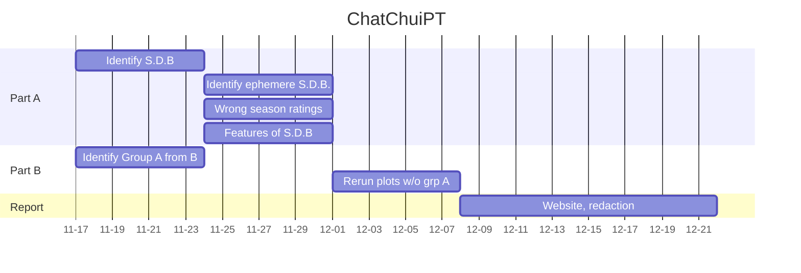

# Every Season is Beerable
# Abstract
- This project aims mainly at studying the beer trends based on seasons. In fact, each individual may tend to consume different
beers based on its mood or feeling influenced by the season. A study of a high variety of beers may helps to see if some beers
have variable success rate accross the year or inversely have a constant consumption rate.
- After identifying how some specific types of beers are consumed at different times of the year, we could dig further those tendencies to see if they also 
varies accross the years. This would let us know if the beer success at some time was ephemere or inversely anchored in the consumption habits of beer drinkers.
- This quantitative analysis of the rate of consumption can be complemented with a sentimental analysis of the ratings and the comments. It is a good point to see that a beer is more consummed at one time in the year, but does the rating and the comments about this beer are also more positives ? This would indicate a change of the drinker's taste preference accross the seasons (in other words, would a user give a better or worse rating depending on wether or not he is consuming at the right time).
- The dataset contains a high number of user of different profiles. We identified 2 main types of users:
    - A: The professional rater, he rates a high number of beers, accross a wide spectrum of beer style throughout the year, he might not taste beers accordingly to his preferences but rather for the sake of testing a high number of beers
    - B: The occasional rater, he rates a small number of beers, actually test beers he wanted to
- Because of the non-seasonal behaviour nature of group A, we might have to first remove the group A to only perform the study on group B

# Research Questions
## `Task 1:` World region
- Base the analysis for different region of the world. Make sure to take into account the hemisphere when evaluating for the season.
- mouais --> better to specialize on one kind of countries !!

## `Task 2:` Season-dependent beer (e.g: beer almost exclusively drank during one season)
- Is a beer more incline to be consumed at one time of the year ? 

## `Task 3:` Ephemere and long-lasting season dependent beers
- Do some beers only follow one season trend and would then be forgotten in the next years ?

## `Task 4:` Features of season-dependent beers
- Which characteristics of a beer makes it to be more a spring-beer or a fall-beer ?

## `Task 5:` Drinking at the wrong season 
- Is there a shift of the season-dependent beer ratings if it is not tasted during the adequate period ?

## `Task 6:` Professional vs Occasional drinker
- Isolate group A from B and re-run all the analysis to see wether or not there is improvement in our analysis without the group A.

## ??
- Are the rating of the beer and the commentary given for it in adequation to each others ?

# Proposed additional datasets (if any) 
- No additional dataset to provide, complete dataset !

# Methods

Graphs plotting for different kind of beers, evolution accross time, evolution between years by superposition, ...
correlation between senitmental analysis of comments and ratings ?
sentimental analysis of comments in order to grade the comments with a high positivity etc for example with the site : 
https://huggingface.co/tasks/text-classification

## Proposed timeline
beers variety accross seasons --> id kind of beers --> compare characteristics --> see tendencies variation accross year 
--> ratings of beers variation accross season also follows trends --> correlation between ratings and sentimental analysis 
of the comments --> beer trends description

## Summary 
### 0. Load the cached data
### 1. Pre-processing datasets for BeerAdvocate and RateBeer
- 1.1 Merge users and ratings to obtain location of each rating especially
- 1.2 Change the date format and isolate month and year
### 2. Data Cleaning 
- 2.1 Remove unrelevant columns/duplicates
- 2.2 Identification of columns that have missing values
- 2.3 Replace abv (alcohol degree) missing values by the average abv of the corresponding beer style
- 2.4 Drop NaN for location -> remove ratings where location is not mentioned
### 3. Compare RateBeers and BeerAdvocate
- 3.1 Distribution of ratings and reviews between BeerAdvocate and RateBeer
- 3.2 Are raters also writers? Check nbr of reviews compared to nbr of ratings
- 3.3 New column: country, to remove states in USA
- 3.4 Plot contribution of different countries in the % of ratings in Beer Advocate and RateBeer
- 3.5 Mapping of ratings
- 3.6 What is the most rated style the whole world (in RateBeer)?
- 3.7 Supervised Learning : the relation between the features (*appearance, aroma, palate, taste, overall*) and response (*rating*)
- 3.8 Do we have users in common for both datasets?
### 4. Exploration of the dataset RateBeer: Seasonal tendancies?
- 4.1 Distribution of ratings per month for all beers
- 4.2 Distribution of IPA, Pilsner and Belgian Strong Ale reviews normalized according to total number of reviews
- 4.3 Distribution of alcohol degree among beers compared to ratings -> do people drink a lot of strong beers?
  

